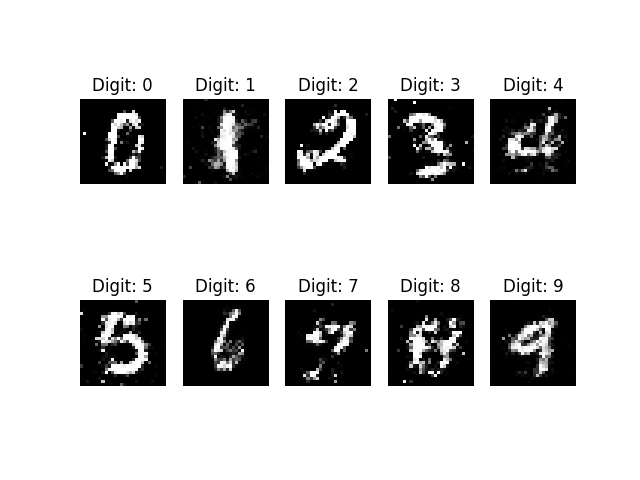

# Conditional Generative Adversarial Network (CGAN) for MNIST  
**شبکه مولد تخاصمی شرطی برای تولید اعداد MNIST**

[](https://www.python.org/)  
[](https://keras.io/)  
[](https://www.tensorflow.org/)  
[](https://matplotlib.org/)  
[](https://numpy.org/)

---

## Table of Contents (English)
1. [Introduction](#introduction)
2. [Key Features](#key-features)
3. [Technologies Used](#technologies-used)
4. [Installation](#installation)

---

## فهرست مطالب (فارسی)
1. [مقدمه](#مقدمه)
2. [ویژگی‌های اصلی](#ویژگی‌های-اصلی)
3. [تکنولوژی‌های استفاده‌شده](#تکنولوژی‌های-استفاده‌شده)
4. [نصب و راه‌اندازی](#نصب-و-راه‌اندازی)

---

## Introduction
This project implements a Conditional Generative Adversarial Network (CGAN) trained on the MNIST dataset. The model can generate specific handwritten digits (0-9) by conditioning both the generator and discriminator on class labels. The implementation includes:
- Label embedding layers
- Interactive training monitoring
- Dynamic sample generation
- Batch normalization
- Adam optimization

---

## مقدمه
این پروژه یک شبکه مولد تخاصمی شرطی (CGAN) را پیاده‌سازی می‌کند که روی مجموعه داده MNIST آموزش دیده است. این مدل توانایی تولید اعداد دستنویس خاص (0-9) را با استفاده از شرطی کردن شبکه مولد و تشخیص‌دهنده بر اساس برچسب کلاس‌ها دارد. ویژگی‌های کلیدی شامل:
- لایه‌های جاسازی برچسب
- مانیتورینگ تعاملی فرآیند آموزش
- تولید نمونه‌های پویا
- نرمالیزه کردن دسته‌ای
- بهینه‌سازی Adam

---

## Key Features / ویژگی‌های اصلی
- **Conditional Generation / تولید شرطی:**  
  Generate digits with specified labels through noise + label input
  
- **Deep Neural Architecture / معماری شبکه عمیق:**  
  3 hidden layers (256-512-1024 units) with Batch Normalization
  
- **Dynamic Sampling / نمونه‌گیری پویا:**  
  Save generated samples every N epochs
  
- **Advanced Training / آموزش پیشرفته:**  
  Simultaneous adversarial training with label conditioning
  
- **Error Handling / مدیریت خطا:**  
  Comprehensive exception handling and logging

---

## Technologies Used / تکنولوژی‌های استفاده‌شده
- **Keras 2.2.4+** - High-level neural networks API
- **TensorFlow 1.15+** - Backend computation
- **Matplotlib 3.1+** - Visualization of generated digits
- **NumPy 1.18+** - Numerical computations
- **Python 3.6+** - Core programming language

---

## Installation / نصب و راه‌اندازی

### English
```bash
git clone https://github.com/yourusername/cgan-mnist.git
cd cgan-mnist
pip install -r requirements.txt 
```


---



---


